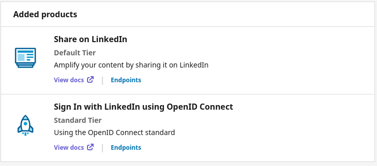
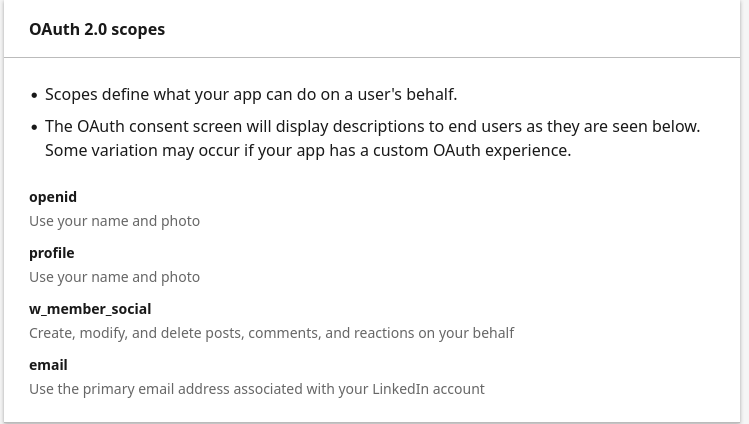
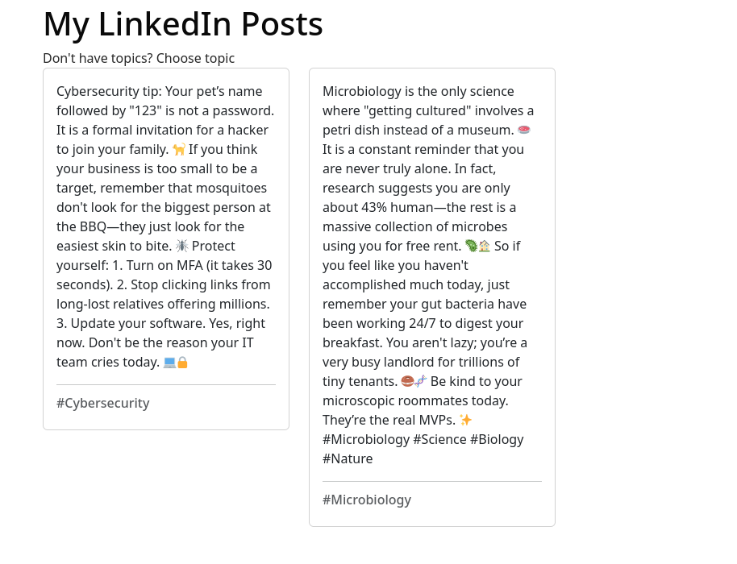
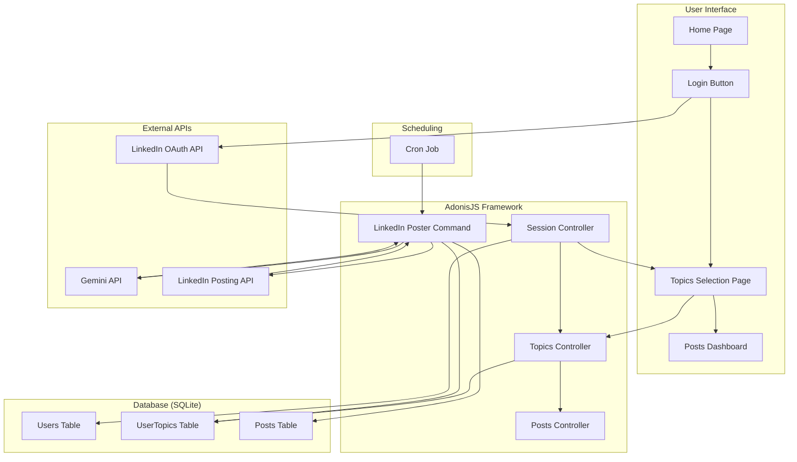
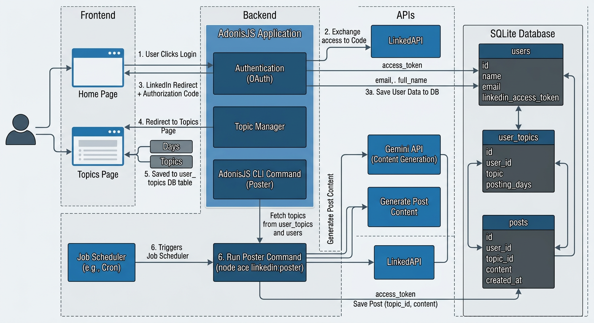

# LinkedIn Posting Bot

This is simply web application for posting on random topics to LinkedIn posts


## Requirements

1. [NodeJS](https://nodejs.org/en)
2. [Git](https://git-scm.com/)
3. [Gemini API Key](https://ai.google.dev/)
4. [LinkedIn Developer Account](https://developer.linkedin.com/)


## Project Setup

Clone the repo:
```sh
git clone https://github.com/ephrimlawrence/linkedin-bot.git
```

Create `.env` file:
```sh
cp .env.example .env
```

Install dependencies:

```sh
cd linkedin-bot
npm install
```

Run migrations:
```sh
node ace migration:run
```

Start server:
```sh
npm run dev
```

## Configuration

The application depends on two external services: Gemini for generating post content and LinkedIn API for posting on LinkedIn.

### Gemini

Obtain a Gemini API from [Google AI Studio](https://ai.google.dev/) using your Gmail account. Update `GEMINI_API_KEY` in the .env file with the API from Google AI Studio.

### LinkedIn

Follow these steps to setup a LinkedIn:
1. Log-in to your LinkedIn account
2. Go to [LinkedIn Developers](https://developer.linkedin.com/) page and create a new app
3. Go to the **"Products"** tab on the developers dashboard, enable **Share on LinkedIn"** and **" Sign In with LinkedIn using OpenID Connect"** products.
   
4. Navigate to the **"Auth"** tab:
   1. Under *Application Credentials*, copy **Client ID:** and **Primary Client Secret:** to `LINKEDIN_CLIENT_ID` and `LINKEDIN_CLIENT_SECRET` to the **.env** file respectively.
   2. Under *OAuth 2.0 settings*, enter `http://localhost:3333/oauth-redirect` as the redirect URL.
   3. Finally, verify that OAuth scopes is enabled for **openid, profile, w_member_social and email**
   
5. Go to the **"Settings"** tab to upload an app logo
6. Restart the server, if already running


## Application Walkthrough

Access the application on [http://localhost:3333](http://localhost:3333).

On the home page, click on the **Login** button to sign in with a LinkedIn Account. After signing, it redirects the user to choose topics and days of the week to post on LinkedIn.

All LinkedIn posts can be viewed on the [posts page](http://localhost:3333/posts).



## Cron Job: Automated Posts

The application uses cron job run automated posts. By default, the cron job is executed 6am each day.

Update `crontab.txt` with the full page to the project directory. Execute the commands below to enable the cron job.

```sh
crontab crontab.txt
crontab -l
```


## Architecture Decisions

1. [AdonisJS](https://docs.adonisjs.com/) was choosen for the project because it has all the needed components (command, database, server, HTML rendering, etc.) already implemented. I didn't want to spend time configuring stuff from scratch
2. SQLite is used as the database for easier setup, and also because it is a demo app. Although, the db can be changed to MySQL, PostgreSQL or MongoDB since it already supported by Lucide (AdonisJS ORM)
3. The html is server rendered ([Edge](https://docs.adonisjs.com/guides/frontend/edgejs) template) as didn't have enough time to build auth and APIs from scratch.

Flow Diagram:




> This diagram is generated by Gemini AI

## TODOS
* Redesign the user interface, it is too bare bones
* Figure out a away to bypass LinkedIn signin bot detection and add e2e tests
